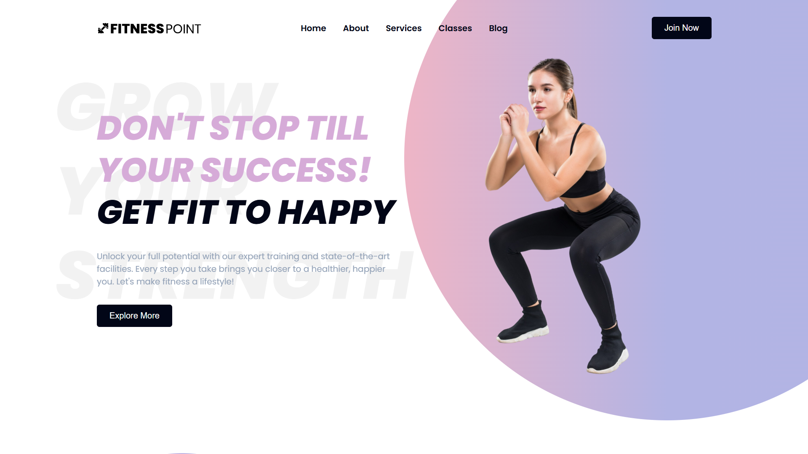

<div align="center">
  
  
  
  

  <br />
  <br />

  <h2 align="center">FitnessPoint - GYM website</h2>

  FitnessPoint is a fully responsive Gym website, <br />Responsive for all devices, built using HTML, CSS, and JavaScript.

   <a href="https://adnan-bhaldar.github.io/FitnessPoint" target="_blank"><strong>➥ Live Demo</strong></a>

</div>

<br />

### Demo Screeshots



### Prerequisites

Before you begin, ensure you have met the following requirements:

* [Git](https://git-scm.com/downloads "Download Git") must be installed on your operating system.

### Features
Before you begin, here are some FitnessPoint features
- Responsive Gym Website Design Using HTML CSS & JavaScript
- Contains animations when scrolling.
- Includes a form to calculate body mass index.
- Includes a form to send emails.
- Developed first with the Mobile First methodology, then for desktop.
- Compatible with all mobile devices and with a beautiful and pleasant user interface.


### Run Locally

To run **FitnessPoint** locally, run this command on your git bash:

Linux and macOS:

```bash
sudo git clone https://github.com/adnan-bhaldar/FitnessPoint.git
```

Windows:

```bash
git clone https://github.com/adnan-bhaldar/FitnessPoint.git
```